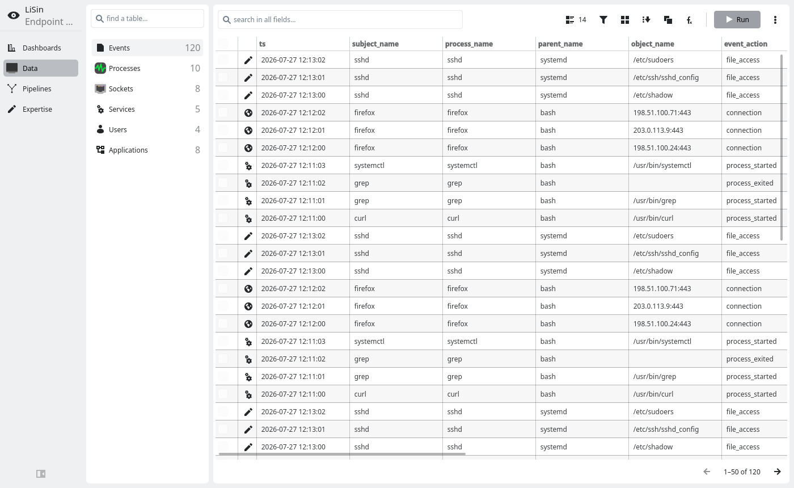
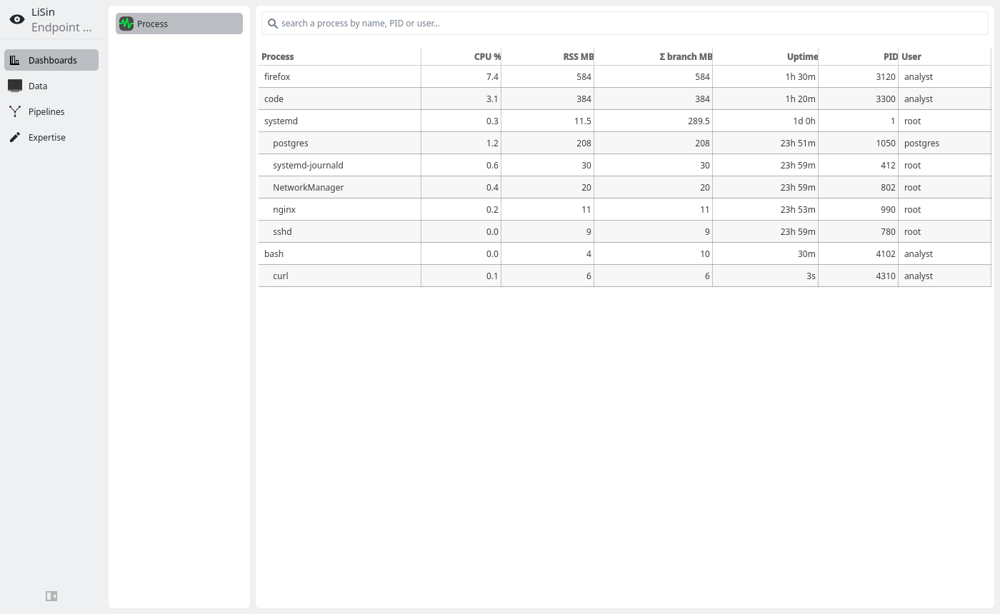
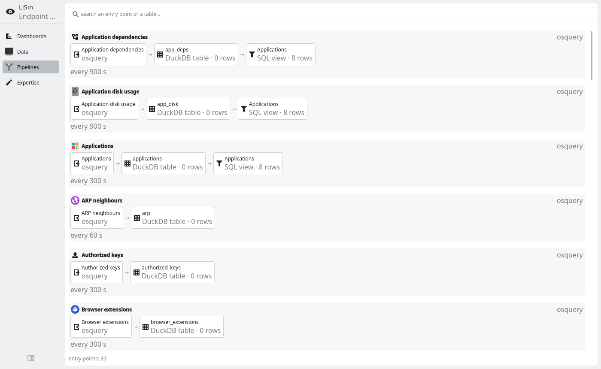
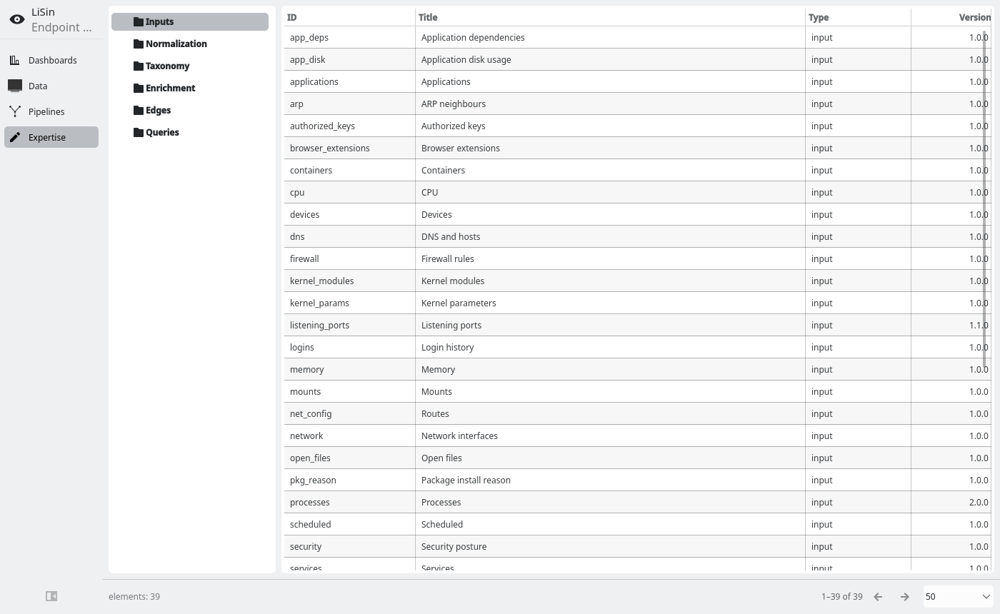

# LiSin v1 — a light EDR for one Fedora laptop

Two sensors, one database, one desktop app:

- **osquery** answers *what is on this machine* — every source is an SQL query in
  a YAML rule, and its result replaces a table (a snapshot, not a diff). Where
  osquery has no answer (systemd timers, firewalld, browser profiles), the rule
  runs a command instead and the engine reads its output the same way.
- **Tetragon (eBPF)** answers *what is happening* — exec, exit, connect and
  access to credential files, as they occur.
- **DuckDB** stores both: `v1.duckdb` for state (snapshots), `v1-events.duckdb`
  for the event stream (append + retention).
- **Qt/QML (Kirigami)** reads it. No web interface, no cloud, no telemetry.
- **One process owns the databases** and serves reads to any other on a Unix
  socket, because DuckDB locks a file exclusively — so a second window, a script
  or the test suite can read while the first keeps collecting.

Nothing leaves the machine. The only outbound traffic the agent itself makes is
none: osquery and rpm read locally, `dnf repoquery -C` reads the metadata cache
that the system already downloaded.

## What it looks like

| | |
|---|---|
|  | **Data** — every source as a table: the event stream first, then processes, sockets, open files, services, accounts, the privilege surface, installed software, the network. One query bar over all of them: free text, a condition builder, or SQL by hand. |
|  | **Process** — the process tree with what each one costs: CPU, its own memory, the memory of its whole branch, and how long it has been running. |
|  | **Pipelines** — the data flows as they really are: entry point → table → enrichment view, with live row counts and each source's own cadence. Built from the rules, so a new source appears here by itself. A failing source is marked here, not left looking stale. |
|  | **Expertise** — the rules themselves: inputs, the event normalization, the taxonomy, enrichment views. Readable and editable in place. |

*(The screenshots are rendered from invented data — see below.)*

## Where the knowledge lives

In `expertise/`, not in the code:

```
expertise/inputs/*.yaml      an entry point: an osquery query (or a command)
                             plus its table, cadence and the columns worth
                             reading first
expertise/outputs/*.yaml     an output point: a table declared with its fields,
                             created because it was declared — so a table exists
                             with its columns before anything writes to it
expertise/views/*.yaml       enrichment: a SQL view that JOINs base tables
expertise/events/*.yaml      how a Tetragon line becomes a taxonomy row
expertise/taxonomy/*.yaml    the event field vocabulary
```

Adding a source is adding a YAML file — a new tab appears without touching the
application. The engine (`core/`) knows how to run and store; it knows nothing
about processes, packages or sockets.

## Running it

```bash
v1/bootstrap.sh                     # vendored DuckDB (not committed)
PYTHONNOUSERSITE=1 QT_QUICK_CONTROLS_STYLE=org.kde.desktop python3 v1/lisin_app.py
```

Events need Tetragon installed as a root service; the app reads its JSON export
and works without it (the Events tab is simply empty).

## Checking it

```bash
systemctl --user stop lisin.service      # the app holds the database lock
cd v1 && PYTHONNOUSERSITE=1 python3 tests/run.py
```

Fourteen sections. Everything compiles. A full collection runs with no failing
source or view. The read-only guard refuses everything that writes and nothing
that reads. Each rule's own assertions about its table hold. Every declared
column exists. How many columns are empty in every row. Every tab reads a page in
under 60 ms. The event pipeline's invariants — watermark, retention, folding,
bytes per event. A deliberately broken source, and a deliberately stopped
ingest, must surface in the interface. A wasteful database file is rewritten and
keeps every row. A second process reads while this one collects, and is refused a
write. No QML property is both bound and assigned. And every user path — search,
condition, sort, grouping — is walked **on every tab**.

That last one exists because compiling proves the QML parses and rendering proves
it lays out, and neither presses a button: most defects here were a query the
interface builds being refused by the database on one particular table. Several
of the others exist because a defect got past everything else once — each section
names what it caught.

When the application is already running, the suite runs as a follower through its
socket and says which sections it skipped, rather than failing on the lock.

## The screenshots contain no real data

A screenshot of a working EDR is a screenshot of somebody's computer. The images
above are rendered by `tests/screenshots.py`, which points the app at a throwaway
database with collection disabled and fills it with invented rows — addresses
from the ranges RFC 5737 reserves for documentation, a host called `workstation`,
a user called `analyst`. The sandbox is deleted afterwards.

The repository also keeps the machine out by construction: databases, caches and
the working journals are in `.gitignore`, and the rules contain queries, never
results.
